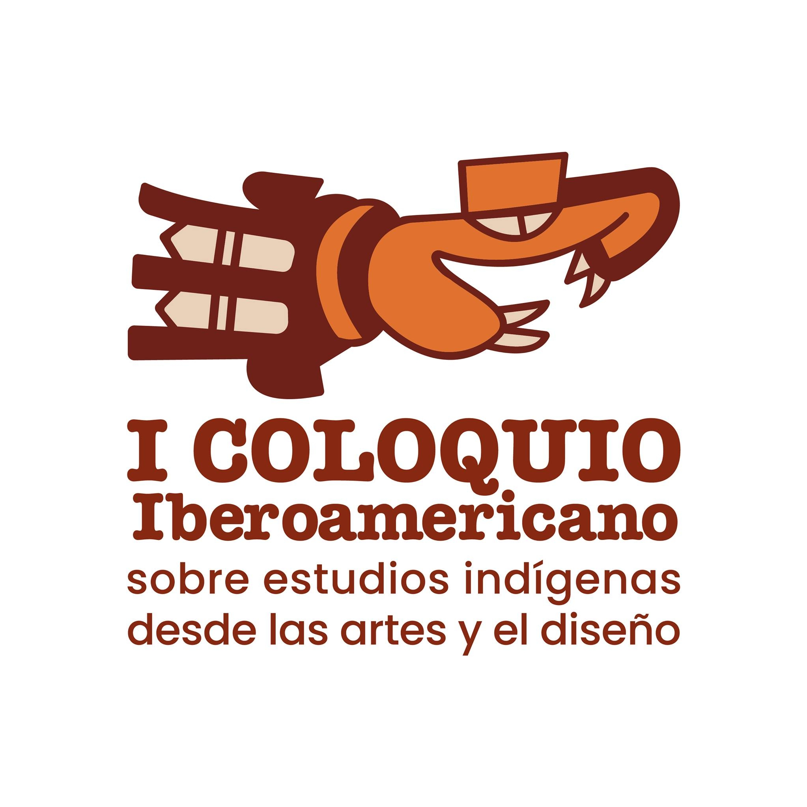

---
authors:
- admin
categories: []
date: "2021-09-09T00:00:00Z"
image:
  caption: ""
  focal_point: ""
lastMod: "2019-09-05T00:00:00Z"
projects: []
subtitle: Estudios Indígenas desde el Arte y el Diseño
summary: Evento Internacional
tags: []
title: I Coloquio Iberoamericano
---

## El Coloquio

Esta actividad tuvo lugar entre el 30 de agosto y el 3 de setiembre del 2021 y consistió en un evento virtual que reunió investigadores de toda Iberoamérica, quienes presentaron sus trabajos entorno a estudios realizados sobre el diseño y el arte en  poblaciones indígenas.

## Entre cabezas y hachas. Los diseños en los cinturones de las esculturas de guerreros y tomadores de cabezas de la Región Central, Costa Rica.

Esta ponencia sepresento en coatoria con la Lic. Daniela Meneses (Departamento de Protección al Patrimonio, Museo Nacional de Costa Rica) y busco proponer una metodología de análisis de los motivos representados en los cinturones de esculturas de piedra antropomorfas (esculturas de bulto redondo),  vinculadas con personajes interpretados como guerreros o tomadores de cabezas. Prácticas que tenían un rol de demostración de poder en los grupos sociales que ocuparon la Región Central -específicamente el Caribe- de lo que actualmente es el territorio de Costa Rica.

En este estudio exploratorio, se presentaron los primeros resultados de una investigación en proceso de los autores, donde se documentaron los motivos presentes en los cinturones que portan los personajes representados en las esculturas, con el objetivo de generar un registro de los diferentes diseños para identificar recurrencias o diferencias entre estos y vincularlos con otros elementos de la parafernalia representada en estas esculturas. De esta manera se buscan extraer las distintas pautas de diseño implementados en los cinturones.

