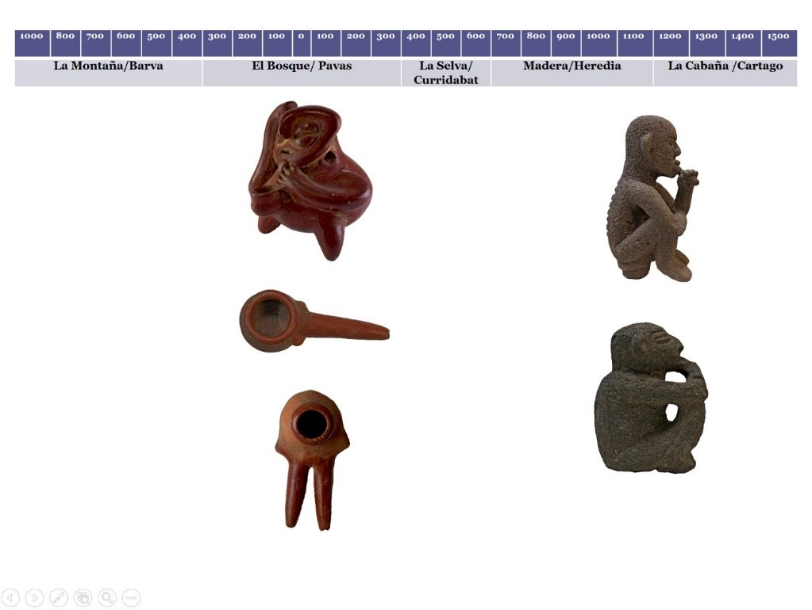

---
authors:
- admin
categories: []
date: "2019-02-05T00:00:00Z"
image:
  caption: ""
  focal_point: ""
lastMod: "2019-09-05T00:00:00Z"
projects: []
subtitle: Plantas Sagradas en la Región Central de Costa Rica
summary: primeros datos sobre plantas sagradas en Costa Rica
tags: []
title: Consumo de plantas y hongos psicoactivos en las culturas precolombinas de Costa Rica
---

## Región Arqueológica Central Caribe

En la región Central Caribe, encontramos una variedad de artefactos que sugieren, de forma indirecta, el consumo de embriagantes durante la época precolombina. La cultura material recuperada evidencia una tradición de consumo de tabaco o cohoba muy clara durante la fase El Bosque, entre el 300 a.C. y el 300 d.C., las figurillas cerámicas que representan personajes fumando con pipas del tipo cerámico Bosque Rojo, así como, inhaladores nasales con motivos antropomorfos y ornitomorfos y pipas de los tipos cerámicos Bosque Rojo sobre Agamuzado y Bosque Rojo, son parte del conjunto de objetos vinculados con el consumo de plantas sagradas para este período en esta región.

Este tipo de evidencia material no solo es un indicador claro del consumo de plantas sagradas sino que también nos permite diferenciar dos tipos de consumo o métodos de administración, a saber, el fumado y el inhalado.
Para la fase La Selva y complejo Madera (300 d.C.- 1100 d.C.), se presenta un vacío en la cultura material vinculada con el consumo de plantas sagradas y es hasta la fase La Cabaña (1100d.C. -1500 d.C.) que se vuelve a tener un registro material que podríamos relacionar de manera indirecta con el consumo de este tipo de plantas; a saber, esculturas de piedra que representan personajes hincados o sentados que presentan características corporales claramente definidas y que podríamos vincular con desnutrición como los son rasgos faciales con prominentes pómulos y mejillas, representación de costillas y espina dorsal que protruyen, una proporción mayor de la cabeza con respecto al cuerpo, en algunos casos estas esculturas presentan unos objetos alargado posiblemente puros, que sostiene con una o ambas manos y dispuestos en cercanía a la boca.

Estas esculturas parecen indicar una transformación en el método de administración, abandonando los artefactos utilizados en fases anteriores como lo son los inhaladores y pipas, remplazándolos con puros. Además, los rasgos corporales descritos sugieren que se trata de representaciones de los sukias o chamanes, los cuales usualmente se sometían a largos ayunos y períodos de deprivación durante su entrenamiento para convertirse en hombres de medicina.

