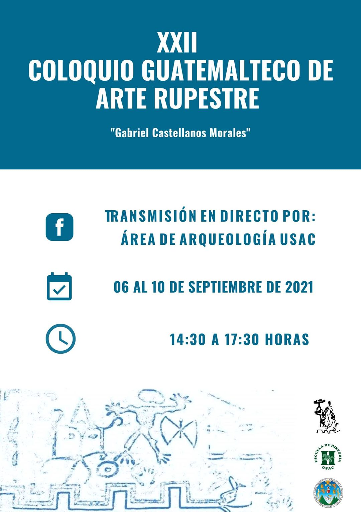

---
authors:
- admin
categories: []
date: "2021-09-09T00:00:00Z"
image:
  caption: ""
  focal_point: ""
lastMod: "2019-09-05T00:00:00Z"
projects: []
subtitle: XXII edición USAC. 
summary: Evento internacional
tags: []
title: Coloquio de Arte Rupestre de Guatemala 
---

## El coloquio

Esta actividad tuvo lugar entre el 6 y 10 de setiembre del 2021 y consistió en un evento virtual que reunió investigadores de Argentina, Colombia, Costa Rica, Nicaragua, Guatemala y México, así como, arqueólogos de Francia y Alemania quienes presentaron sus trabajos entorno a estudios realizados sobre el Arte Rupestre en el continente Americano.

En el evento realizado durante el presente año, tuve la oportunidad de presentar dos ponencias: 

## Entre Luces, Sombras y Pixeles: El uso de la Fotogrametría en el registro de los Petrograbados del Sitio Arqueológico Rosa María

El uso de tecnologías de registro grafico en la arqueología centroamericana, se ha dado paulatinamente y de manera tardía, en comparación con su implementación en la arqueología de otras latitudes, es posible que esto se deba en un principio al costo de los instrumentos y software necesarios para su implementación.

Esta ponencia presenta el resultado de la aplicación de la fotogrametría digital para la documentación y análisis de los 14 petrograbados registrados en el Sitio Arqueológico Rosa María. La Fotogrametría permitió registrar, definir y analizar la forma, dimensiones, diseños y disposición en el espacio de los petrograbados dentro del yacimiento Arqueológico, a partir de medidas realizadas por software computacionales, utilizando como medio varias fotografías del rasgo, con esto se obtuvieron modelos en tercera dimensión de cada uno de los petrograbados. 
En la presente ponencia se discute de forma breve la utilidad de la aplicación de estas técnicas para el registro y análisis del arte rupestre en particular, a partir de un caso de estudio propio de nuestra región. 
	
	El objetivo de esta ponencia es socializar la metodología implementa para el registro y análisis de objetos tomados en consideración como  parte del trabajo final de graduación titulado: “Aplicación de un Sistemas de Información Geográfica en la determinación de condiciones hidrológicas y sistemas hidráulicos del sitio arqueológico Rosa María, cantón Turrialba, Costa Rica”, dicha investigación corresponde al trabajo final de graduación para optar por el grado de Magister en Sistemas de Información Geográfica y Teledetección por la Universidad de Costa Rica y la Universidad Nacional.

## El registro de los petrograbados en el sitio arqueológico Rosa María: Una aproximación desde los SIG, a través de QField. 

El Sitio Arqueológico Rosa María se encuentra ubicado en Costa Rica, en la región arqueológica Central-Caribe, propiamente en la provincia de Cartago, en el cantón de Turrialba, distrito de la Suiza. Este yacimiento presenta tres sistemas hidráulicos, zonas funerarias, así como 11 petrograbados in situ, estos últimos asociados con las obras hidráulicas (Arce y Peytrequín, 2018 ).

	En esta ponencia se presenta la implementación de la aplicación Open Source QField, de QGIS, para el registro y levantamiento de datos espaciales en campo, haciendo énfasis en la obtención de información de los petrograbados de Rosa María.
	
	El uso de QField, permitió generar un levantamiento de datos más eficiente en el campo, mediante la implementación de un cuestionario, utilizando únicamente un dispositivo Android, marca Samsung, modelo A31, estos datos fueron almacenados en dicho dispositivo y posteriormente trasladados a un ordenador para su análisis.
	
	El objetivo de esta ponencia es socializar la metodología implementa para la obtención de datos en campo como  parte del trabajo final de graduación titulado: “Aplicación de un Sistemas de Información Geográfica en la determinación de condiciones hidrológicas y sistemas hidráulicos del sitio arqueológico Rosa María, cantón Turrialba, Costa Rica”, dicha investigación corresponde al trabajo final de graduación para optar por el grado de Magister en Sistemas de Información Geográfica y Teledetección por la Universidad de Costa Rica y la Universidad Nacional. 

