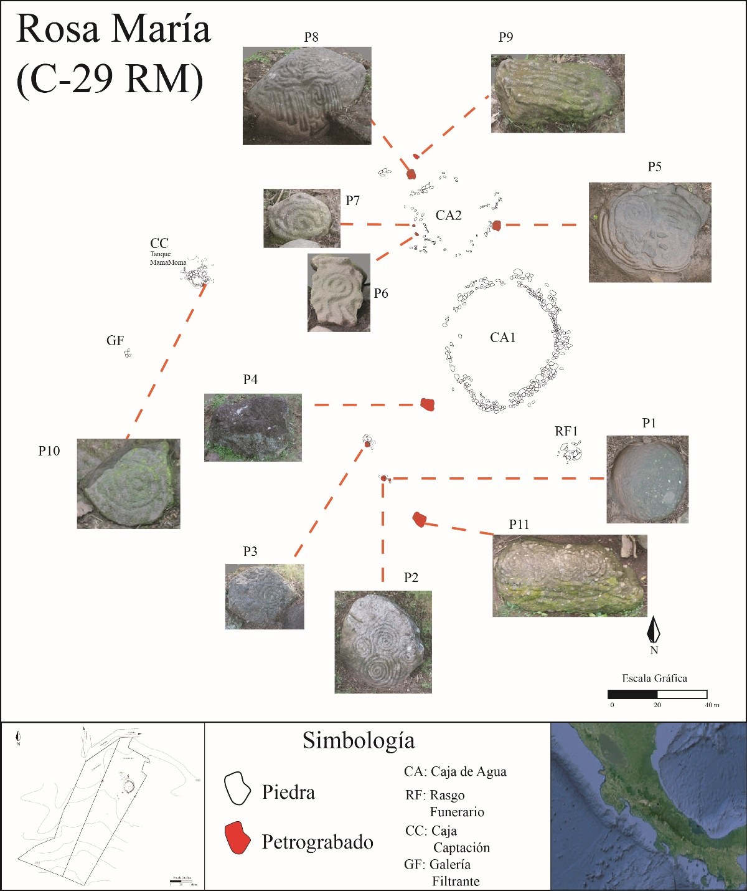

---
date: "2016-04-27T00:00:00Z"
external_link: ""
image:
  caption: 
  focal_point: Smart
links:
- icon: facebook
  icon_pack: fab
  name: Follow
  url: https://www.facebook.com/fincavialig
slides: example
summary: Proyecto Arqueológico Rosa María (PARMA).

## EL Proyecto Arqueológico Rosa María (PARMA)

El sitio arqueológico Rosa María se encuentra ubicado en el distrito La Suiza, cantón de Turrialba, en la provincia de Cartago, este lugar se caracteriza por presentar tres sistemas hidráulicos independientes de captación de aguas, los cuales se encuentran interconectados ya que desaguan a la margen derecha del río Pacayitas.  

Este yacimiento destaca, además, por la presencia de 11 petrograbados in situ ubicados cerca o como parte de las estructuras hidráulicas que conforman los sistemas de captación de aguas, además de 3 petrograbados más, que no están in situ. Esto quiere decir que en un área de 2500m², se han registrado 14 petrograbados, una densidad bastante alta para los sitios arqueológicos del Caribe de Costa Rica, comparable solo con el Monumento Nacional Guayabo.

PARMA, es un proyecto sin fines de lucro, que busca indagar en la construcción de las obras hidráulicas presentes en Rosa María, para poner en valor mediante distintas estrategias el patriominio arqueológico resguardado por los dueños de la Finca Vialig.

## Sub Proyectos

“Aplicación de un Sistemas de Información Geográfica en la determinación de condiciones hidrológicas y sistemas hidráulicos del sitio arqueológico Rosa María, cantón Turrialba, Costa Rica” (Trabajo Final de Graduación) Marco Antonio Arce Cerdas.

## Productos Academicos

(2016). “Obras hidráulicas antiguas del Centro y el Caribe costarricense (600-
1200 d.C.): una propuesta formal de clasificación”. (Coautoría con Jeffrey
Peytrequín Gómez). En: Arqueología del Caribe Costarricense: Contribuciones
Científicas, Vol.1.

(2019). “El Motivo de la Espiral y los Meandros en Petrograbados asociados a
Obras Hidráulicas Precolombinas del Caribe de Costa Rica”. (Coautoría con
Jeffrey Peytrequín Gómez). En: Revista Trama, Vol.8., N°1.
